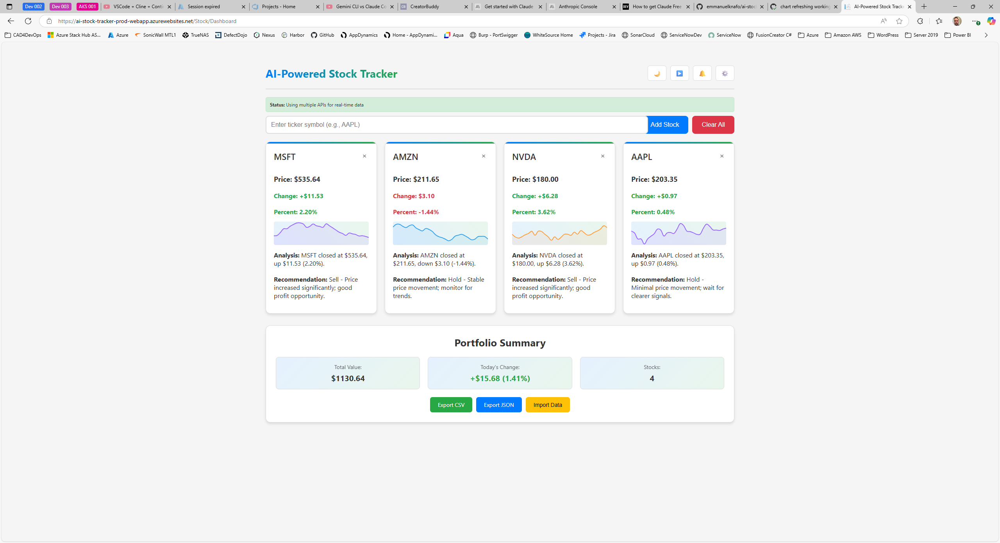
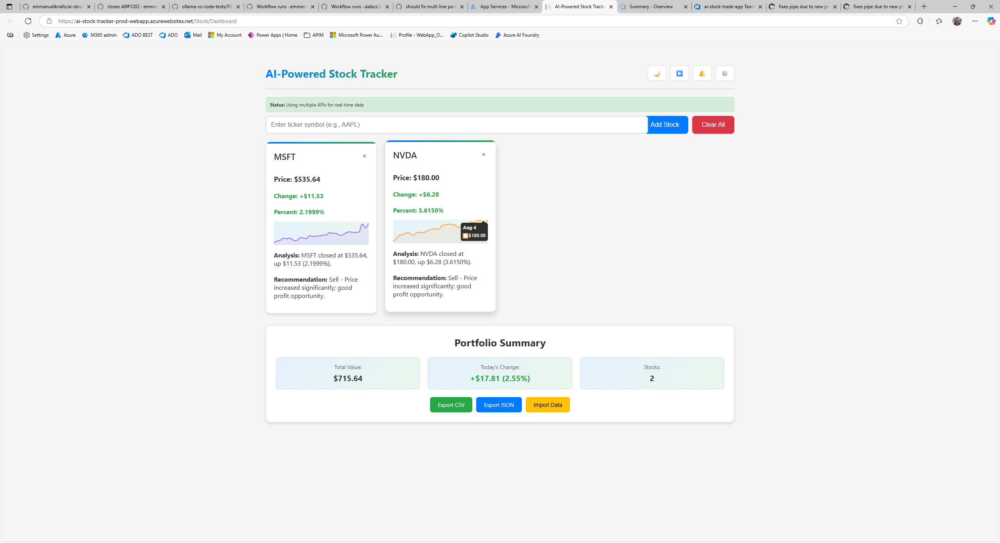
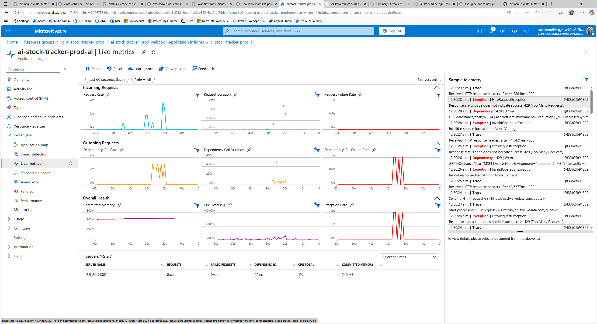
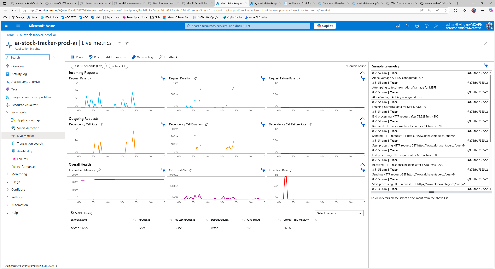

# AI-Powered Stock Tracker Application

A comprehensive multi-project ASP.NET Core solution implementing an AI-powered stock tracking application with clean architecture, real-time data, and Model Context Protocol (MCP) integration for external AI assistant access.









## 🏗️ Solution Architecture

This solution implements a **clean architecture pattern** with clear separation of concerns across multiple projects:

### Core Projects

- **`AiStockTradeApp`** - 🎨 Web UI (MVC) with Razor views and responsive design
- **`AiStockTradeApp.Api`** - 🚀 REST API backend using Minimal API pattern
- **`AiStockTradeApp.Entities`** - 📊 Domain models and view models
- **`AiStockTradeApp.DataAccess`** - 💾 EF Core data layer with repositories
- **`AiStockTradeApp.Services`** - 🔧 Business logic and external API integration

### Specialized Projects

- **`AiStockTradeApp.Tests`** - ✅ Comprehensive unit and integration tests
- **`AiStockTradeApp.UITests`** - 🤖 Playwright end-to-end browser testing
- **`AiStockTradeApp.Cli`** - 📟 Command-line tools for data management
- **`AiStockTradeApp.McpServer`** - 🔌 Model Context Protocol server for AI assistant integration

### Infrastructure

- **`infrastructure/`** - ☁️ Azure Bicep templates for cloud deployment
- **`scripts/`** - 📜 PowerShell automation and development scripts

## ✨ Key Features

### 📊 Core Functionality

- **Real-time Stock Tracking** - Live prices, changes, and percentage movements
- **Personal Watchlists** - Session-based and persistent user watchlists
- **Portfolio Management** - Multi-stock portfolio view and tracking
- **Historical Data** - Price charts and historical analysis
- **Stock Search** - Intelligent symbol lookup with auto-suggestions

### 🤖 AI-Powered Intelligence

- **Smart Analysis** - AI-generated trend analysis and market sentiment
- **Investment Recommendations** - Buy/Hold/Sell suggestions with detailed reasoning
- **Performance Insights** - AI summaries of stock performance over various timeframes
- **Intelligent Alerts** - Smart notifications based on AI analysis patterns

### 🎨 User Experience

- **Responsive Design** - Seamless experience on desktop and mobile
- **Internationalization** - English and French language support
- **Modern Interface** - Clean, professional dashboard with intuitive design
- **Theme Support** - Dark/light mode toggle
- **Authentication** - ASP.NET Identity with user accounts and preferences

### 🔧 Technical Features

- **Multiple Data Sources** - Failover chain: Alpha Vantage → Yahoo Finance → Twelve Data
- **Background Processing** - Automated data refresh and cache management
- **Export/Import** - CSV and JSON format support for data portability
- **Health Monitoring** - Application health checks and diagnostics
- **Containerization** - Docker support for local development and deployment

## 🔌 Model Context Protocol (MCP) Integration

The **AiStockTradeApp.McpServer** project provides MCP integration, enabling external AI assistants (Claude, ChatGPT, etc.) to access stock trading functionality through standardized tools.

### Available MCP Tools

- **GetStockQuote** - Real-time stock quotes and market data
- **GetHistoricalData** - Historical price information with date ranges
- **SearchStockSymbols** - Stock symbol search by company name
- **GetStockDetails** - Detailed company information and metadata
- **GetListedStocks** - Browse available stocks with pagination
- **GetSystemStatus** - API health and availability monitoring

### MCP Server Setup

```json
{
  "servers": {
    "AiStockTradeApp.McpServer": {
      "type": "stdio",
      "command": "dotnet",
      "args": ["run", "--project", "AiStockTradeApp.McpServer"],
      "env": {
        "STOCK_API_BASE_URL": "http://localhost:5000"
      }
    }
  }
}
```

## 🛠️ Technology Stack

### Core Framework

- **.NET 9** - Latest LTS framework
- **ASP.NET Core MVC** - Web UI with server-side rendering
- **ASP.NET Core Minimal API** - REST API backend
- **Entity Framework Core 9** - ORM with SQL Server/Azure SQL

### Frontend Technologies

- **Razor Views** - Server-side rendering with C#
- **Bootstrap 5** - Responsive CSS framework
- **JavaScript/jQuery** - Client-side interactions
- **Chart.js** - Stock data visualization
- **Font Awesome** - Professional iconography

### Backend Services

- **Dependency Injection** - Built-in DI container
- **Background Services** - Scheduled tasks and job processing
- **HTTP Clients** - External API integration with retry policies
- **Memory Caching** - Performance optimization
- **Health Checks** - Application monitoring

### Database & Data

- **SQL Server/Azure SQL** - Primary database
- **Entity Framework Core** - Code-first migrations
- **Repository Pattern** - Data access abstraction
- **In-Memory Database** - Testing scenarios

### Testing & Quality

- **xUnit** - Unit testing framework
- **Moq** - Mocking framework for dependencies
- **Playwright** - End-to-end browser automation
- **FluentAssertions** - Expressive test assertions

### External Integrations

- **Alpha Vantage API** - Primary stock data source
- **Yahoo Finance API** - Fallback stock data
- **Twelve Data API** - Alternative stock data source
- **Azure Application Insights** - Telemetry and monitoring

### DevOps & Infrastructure

- **Azure Container Registry** - Container hosting
- **Azure App Service** - Web application hosting
- **Azure SQL Database** - Managed database service
- **Docker** - Containerization support
- **Bicep** - Infrastructure as Code
- **GitHub Actions** - CI/CD pipelines

## 🚀 Getting Started

### Prerequisites

- **.NET 9 SDK** - Latest version
- **Visual Studio 2022** or **VS Code** with C# extension
- **SQL Server LocalDB** or **Docker** for database
- **Git** for version control

### Quick Start

1. **Clone the repository**
   ```bash
   git clone https://github.com/emmanuelknafo/AiStockTradeApp.git
   cd AiStockTradeApp
   ```

2. **Use the start script (Recommended)**
   ```powershell
   .\scripts\start.ps1 -Mode Local
   ```

3. **Manual startup (Alternative)**
   ```bash
   # Restore dependencies
   dotnet restore AiStockTradeApp.sln
   
   # Build the solution
   dotnet build AiStockTradeApp.sln
   
   # Run database migrations (if using SQL Server)
   dotnet ef database update --project AiStockTradeApp.DataAccess
   
   # Start the API (in one terminal)
   dotnet run --project AiStockTradeApp.Api
   
   # Start the UI (in another terminal)
   dotnet run --project AiStockTradeApp
   ```

### Configuration

1. **API Keys** - Update `appsettings.Development.json`:
   ```json
   {
     "AlphaVantage": {
       "ApiKey": "YOUR_ALPHA_VANTAGE_API_KEY"
     },
     "TwelveData": {
       "ApiKey": "YOUR_TWELVE_DATA_API_KEY"
     }
   }
   ```

2. **Database** - Configure connection string if needed:
   ```json
   {
     "ConnectionStrings": {
       "DefaultConnection": "Server=(localdb)\\mssqllocaldb;Database=AiStockTradeApp;Trusted_Connection=true"
     }
   }
   ```

### API Key Sources

- **Alpha Vantage** - [Get free API key](https://www.alphavantage.co/support/#api-key)
- **Twelve Data** - [Get free API key](https://twelvedata.com/pricing) (800 requests/day)

## 🧪 Testing

### Unit Tests

```bash
# Run all unit tests
dotnet test AiStockTradeApp.Tests

# Run with coverage
dotnet test --collect:"XPlat Code Coverage"

# Run specific test categories
dotnet test --filter "Category=Unit"
dotnet test --filter "FullyQualifiedName~StockControllerTests"
```

### UI Tests (Playwright)

```bash
# Install Playwright browsers (first time only)
dotnet build AiStockTradeApp.UITests
playwright install

# Run UI tests (auto-starts application)
dotnet test AiStockTradeApp.UITests

# Run with in-memory database (faster)
$env:USE_INMEMORY_DB = "true"
dotnet test AiStockTradeApp.UITests

# Disable auto-start (manual app startup required)
$env:DISABLE_UI_TEST_AUTOSTART = "true"
dotnet test AiStockTradeApp.UITests
```

## 📦 Docker Support

The application includes comprehensive Docker support for local development and deployment. The Docker configuration is designed to avoid port conflicts with host services.

### Development with Docker Compose

```bash
# Quick start with Docker (recommended)
.\scripts\start.ps1 -Mode Docker

# Manual Docker Compose commands
# Start all services
docker-compose up --build

# Start with MCP server
docker-compose -f docker-compose.yml -f docker-compose.mcp-override.yml up --build

# Stop services
docker-compose down
```

### 🔌 Port Configuration

To avoid conflicts with existing services on your host machine, the Docker configuration uses the following port mappings:

| Service | Container Port | Host Port | Access URL |
|---------|---------------|-----------|------------|
| Web UI | 8080 | 8080 | <http://localhost:8080> |
| REST API | 8080 | 8082 | <http://localhost:8082> |
| MCP Server | 8080 | 5000 | <http://localhost:5000/mcp> |
| SQL Server | 1433 | **14330** | localhost,14330 |

> **Note**: SQL Server uses port **14330** on the host (instead of the default 1433) to avoid conflicts with existing SQL Server installations.

### 🗄️ Database Access from Host

When running in Docker mode, you can connect to the SQL Server container from your host machine using:

- **Server**: `localhost,14330` (note the comma, not colon)
- **Database**: `StockTraderDb`
- **Username**: `sa`
- **Password**: `YourStrong@Passw0rd`
- **Connection String**: `Server=localhost,14330;Database=StockTraderDb;User Id=sa;Password=YourStrong@Passw0rd;TrustServerCertificate=true;MultipleActiveResultSets=true`

Use the helper script to get connection details and optionally launch SQL management tools:

```powershell
# Display connection information
.\scripts\connect-to-docker-sql.ps1

# Launch SQL Server Management Studio with connection details
.\scripts\connect-to-docker-sql.ps1 -Tool SSMS

# Launch Azure Data Studio with connection details
.\scripts\connect-to-docker-sql.ps1 -Tool ADS
```

### Individual Container Builds

```bash
# Build UI container
docker build -f AiStockTradeApp/Dockerfile -t ai-stock-ui .

# Build API container
docker build -f AiStockTradeApp.Api/Dockerfile -t ai-stock-api .

# Build MCP server container
docker build -f AiStockTradeApp.McpServer/Dockerfile -t ai-stock-mcp .
```

## ☁️ Azure Deployment

### Infrastructure Deployment

```bash
# Navigate to infrastructure directory
cd infrastructure

# Deploy to development environment
az deployment group create \
  --resource-group myResourceGroup \
  --template-file main.bicep \
  --parameters @parameters.dev.json

# Deploy to production environment
az deployment group create \
  --resource-group myResourceGroup \
  --template-file main.bicep \
  --parameters @parameters.prod.json
```

### GitHub Actions CI/CD

The solution includes automated deployment pipelines:

- **`.github/workflows/`** - CI/CD workflows
- **Federated Identity** - Secure Azure authentication
- **Environment-specific deployments** - Dev, staging, and production

## 📊 Usage Guide

### Adding Stocks

1. **Search** - Type ticker symbol (e.g., AAPL, GOOGL, MSFT)
2. **Auto-suggestions** - Get popular stock recommendations
3. **Add to watchlist** - Click "Add Stock" button
4. **View details** - Stock cards show current price, change, and analysis

### Managing Watchlists

- **Remove stocks** - Click the remove button on stock cards
- **Clear all** - Use "Clear Watchlist" button
- **Export data** - Download as CSV or JSON
- **Import data** - Upload previously exported files

### AI Analysis

- **Trend analysis** - AI-generated market sentiment
- **Investment recommendations** - Buy/Hold/Sell suggestions
- **Performance insights** - Historical analysis summaries
- **Smart alerts** - AI-based price notifications

### User Accounts

- **Registration** - Create personal accounts
- **Persistent watchlists** - Saved across sessions
- **Preferences** - Language, theme, and alert settings
- **Portfolio tracking** - Multi-stock portfolio management

## 🔧 Development Workflow

### Making Changes

1. **Create feature branch** from main
2. **Follow established patterns** - Dependency injection, repository pattern
3. **Add tests** - Unit tests for services, UI tests for features
4. **Update localization** - Add translations for new text
5. **Run full test suite** before committing
6. **Create pull request** with descriptive commit messages

### Code Review Checklist

- [ ] All user-facing text is localized (English + French)
- [ ] Error handling implemented with appropriate logging
- [ ] Unit tests cover new functionality
- [ ] Database migrations included if schema changed
- [ ] API documentation updated if endpoints changed
- [ ] Security considerations addressed
- [ ] Performance impact assessed

## 📚 Architecture Documentation

### Clean Architecture Principles

- **Domain-Driven Design** - Business logic in services layer
- **Dependency Inversion** - High-level modules don't depend on low-level modules
- **Separation of Concerns** - Clear boundaries between layers
- **Testability** - All components are unit testable
- **API-First Design** - Separate UI and API for scalability

### Project Dependencies

```text
AiStockTradeApp (UI)
├── AiStockTradeApp.Services (API client only)
└── AiStockTradeApp.Entities

AiStockTradeApp.Api
├── AiStockTradeApp.Services
├── AiStockTradeApp.DataAccess
└── AiStockTradeApp.Entities

AiStockTradeApp.Services
├── AiStockTradeApp.DataAccess
└── AiStockTradeApp.Entities

AiStockTradeApp.DataAccess
└── AiStockTradeApp.Entities

AiStockTradeApp.McpServer
└── HTTP client to API
```

## 🌐 Internationalization

The application supports English and French localization:

### Adding New Languages

1. **Update SimpleStringLocalizer.cs** - Add translation dictionary
2. **Configure Program.cs** - Add supported culture
3. **Test language switching** - Verify all UI elements

### Translation Guidelines

- Use `@inject IStringLocalizer<SharedResource>` in Razor views
- Follow naming convention: `ComponentName_ElementName`
- Add translations to both "en" and "fr" dictionaries
- Test culture switching functionality

## 🔒 Security Features

### Authentication & Authorization

- **ASP.NET Core Identity** - User account management
- **Session management** - Secure session handling
- **CSRF protection** - Anti-forgery tokens
- **Input validation** - Data annotations and model validation

### API Security

- **HTTPS enforcement** - TLS encryption required
- **Rate limiting** - Prevent API abuse
- **CORS configuration** - Cross-origin request control
- **Input sanitization** - XSS prevention

### Production Security

- **Azure Key Vault** - Secure secret management
- **Managed Identity** - Secure Azure resource access
- **Private endpoints** - Network isolation options
- **Azure AD authentication** - Enterprise authentication

## 🚨 Troubleshooting

### Common Issues

#### Database Connection Errors

```bash
# Update database with latest migrations
dotnet ef database update --project AiStockTradeApp.DataAccess

# Check SQL Server/LocalDB status
sqlcmd -S "(localdb)\MSSQLLocalDB" -Q "SELECT @@VERSION"
```

#### API Key Issues

- Verify API keys in `appsettings.Development.json`
- Check rate limits on external APIs
- Test fallback API sources

#### Localization Problems

- Verify `SimpleStringLocalizer.cs` has required translations
- Check culture configuration in `Program.cs`
- Test language switching functionality

#### UI Test Failures

- Ensure application is running before tests
- Check database cleanup between tests
- Verify selectors haven't changed

## 🔄 Maintenance

### Regular Tasks

- **Update NuGet packages** monthly for security patches
- **Review API keys** and rotate quarterly
- **Database maintenance** - statistics and index optimization
- **Monitor performance** and adjust caching strategies
- **Error log review** - implement fixes for common issues

### Health Monitoring

- **Application Insights** - Performance and error tracking
- **Health check endpoints** - `/health` for monitoring
- **Database health** - Connection and query performance
- **External API health** - Data source availability

## 🤝 Contributing

We welcome contributions! Please see:

- **[CONTRIBUTING.md](CONTRIBUTING.md)** - Contribution guidelines
- **[CODE_OF_CONDUCT.md](CODE_OF_CONDUCT.md)** - Community standards
- **[.github/copilot-instructions.md](.github/copilot-instructions.md)** - Development guidelines

## 📄 License

This project is licensed under the MIT License - see the [LICENSE](LICENSE) file for details.

## 🔗 Related Documentation

- **[AGENTS.md](AGENTS.md)** - AI agent integration guide
- **[MCP_INTEGRATION_SUMMARY.md](MCP_INTEGRATION_SUMMARY.md)** - Model Context Protocol details
- **[infrastructure/README.md](infrastructure/README.md)** - Azure deployment guide
- **[docs/](docs/)** - Additional technical documentation


